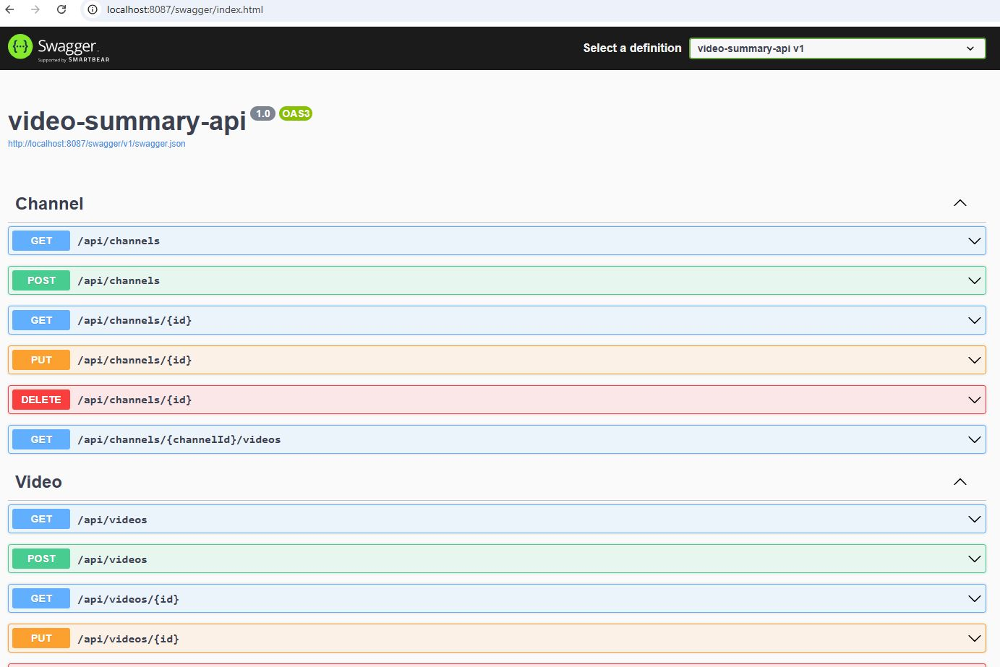

# Build the Docker Images

Assuming that you have already clone the repositories and you have Docker installed on your machine, run the following command:

## Video Summary API

https://github.com/felipecembranelli/video-summary-api

```
cd video-summary-api

docker build -t video-summary-api .
```

Lets now test out API:

```
docker run --name video-summary-api -p 8087:8080 -d video-summary-api:latest
```



## Frontend (Next.Js)

https://github.com/felipecembranelli/video-summary-ui

```
docker run --name video-summary-ui -p 8088:3000 -d video-summary-ui:latest
```

## Backend - Video Summary Collector

https://github.com/felipecembranelli/video-summary-ingestion

```
docker build -t video-summary-ingestion .
```

## Video Processor

https://github.com/felipecembranelli/video-summary-processor

```
docker build -t video-summary-processor .
```