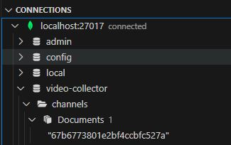
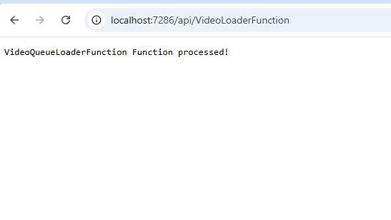
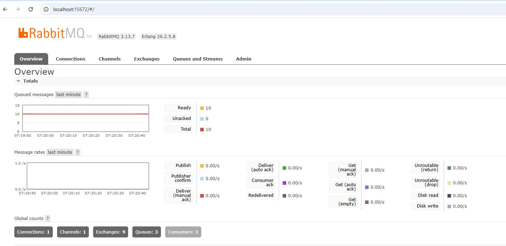
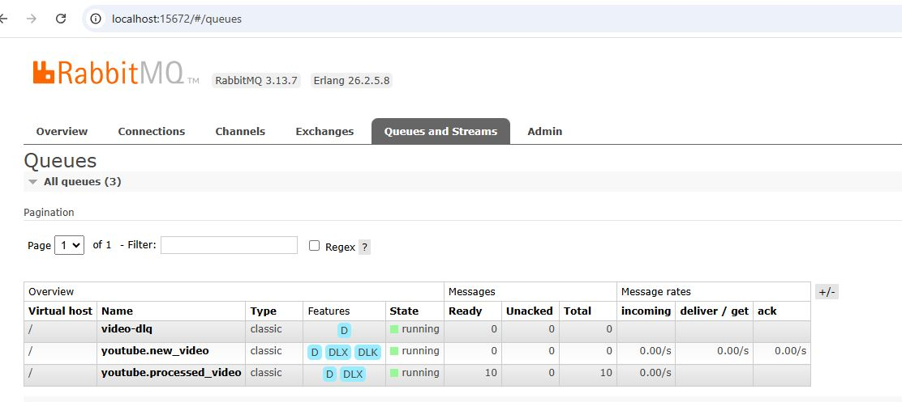
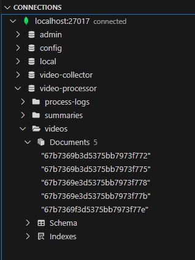

# Setup Local Environment with Docker Compose

Using docker compose to run the docker containers:

1. **Install Docker and Docker Compose**: Ensure you have Docker and Docker Compose installed on your machine. You can download and install them from [Docker's official website](https://www.docker.com/get-started).

2. **Download the docker-compose file**: Open a terminal and navigate to the directory containing your `docker-compose.yml` file from this repository.

https://github.com/felipecembranelli/video-summary-ingestion/blob/master/docker-compose.yml

3. **Build the Docker Images**: If you need to build the Docker images specified in your `docker-compose.yml` file, run:
    ```sh
    docker-compose build
    ```

4. **Replace the API Keys**: 

    ```sh
    YOUTUBE_API_KEY=??
    OPENAI_API_KEY=??
    ```


5. **Start the Docker Containers**: To start the Docker containers defined in your `docker-compose.yml` file, run:
    ```sh
    docker-compose up
    ```

6. **Run in Detached Mode**: If you want to run the containers in the background, add the `-d` flag:
    ```sh
    docker-compose up -d
    ```

7. **Stop the Docker Containers**: To stop the running containers, use:
    ```sh
    docker-compose down
    ```

8. **View Logs**: To view the logs of your running containers, use:
    ```sh
    docker-compose logs
    ```

9. **Access a Running Container**: To access a running container, use:
    ```sh
    docker-compose exec <service_name> /bin/bash
    ```
    Replace `<service_name>` with the name of the service you want to access.

By following these steps, you can easily manage your Docker containers using Docker Compose.


# Testing your Local Environment

Once you have your containers running, you can test your enviroment following the steps:

1. **Configure your YouTube channels**: we will need at least one YouTube channel configured. These will be the channels that will be providing the videos to be summarized. Create the `video-collector` database and `channels` collection as shown:



Insert the following document to the `channels` collection:

```json
{
  "channelId": "UCZgt6AzoyjslHTC9dz0UoTw",
  "title": "ByteByteGo",
  "thumbnailMediumUrl": "https://yt3.ggpht.com/efrVnDJbJOQ5XcXrrFhA9V2wTXh6gP_i0KycoYjqhN3nEh6VbCgqMQakAcFqEsguw7wxhHEjnA=s240-c-k-c0x00ffffff-no-rj",
  "thumbnailMediumHeight": "240",
  "thumbnailMediumWidth": "240",
  "channelUpdateFlag": true,
  "channelCategory": "TECH",
  "channelDescription": "Covering topics and trends in large-scale system design, from the authors of the best-selling System Design Interview book series. This channel is managed by Alex Xu and Sahn Lam.\n\nTo master system design, get our 158-page System Design PDF for free by subscribing to our weekly newsletter (10-min read): https://bit.ly/3tfAlYD\n\nTake our system design online course: https://bit.ly/3mlDSk9\n",
  "lastUpdated": "Wed Aug 21 2024 09:26:32 GMT-0700 (Pacific Daylight Time)",
  "activeStatus": "true"
}
```

2. **Call the Video Ingestion service**: open your browser and call the following url:

```
http://localhost:7286/api/VideoLoaderFunction
```



3. **Check your queues and database**: if everthing goes well, you should see your queues and database as shown below:







Video summarized document example:

```json
{
  "_id": {
    "$oid": "67b7369b3d5375bb7973f772"
  },
  "videoId": "QEzbZKtLi-g",
  "channelId": "UCZgt6AzoyjslHTC9dz0UoTw",
  "videoName": "System Design: Why Is Docker Important?",
  "title": "System Design: Why Is Docker Important?",
  "description": "Get a Free System Design PDF with 158 pages by subscribing to our weekly newsletter: https://bit.ly/bbg-social\n\nAnimation tools: Adobe Illustrator and After Effects.\n\nCheckout our bestselling System Design Interview books: \nVolume 1: https://amzn.to/3Ou7gkd\nVolume 2: https://amzn.to/3HqGozy\n\nThe digital version of System Design Interview books: https://bit.ly/3mlDSk9\n\nABOUT US: \nCovering topics and trends in large-scale system design, from the authors of the best-selling System Design Interview series.",
  "videoUrl": "youtube.com/watch?v=QEzbZKtLi-g",
  "summary": "The video discusses the Core Concepts of Docker, a technology that revolutionizes how applications are built, deployed, and scaled. It delves into the Docker file, which is where the environment for an application is defined by specifying a base image, selecting necessary components, and reducing layers to keep images lean and efficient. Each instruction in the Docker file creates a new layer that captures specific changes and configurations. These layers form Docker images, self-contained packages that include all components needed for an application. Images are immutable, ensuring consistency between development and production environments. Containers are runtime instances of images that share the system's kernel but maintain isolation through Linux kernel features. Docker Registries act as repositories for images, whether publicly on Docker Hub or privately. Data persistence in containers is achieved through Docker volumes, which exist independently and persist data across container life cycles. Docker Compose allows for the definition of multi-container applications in a simple YAML file, facilitating setup of services, networks, and volumes under version control. For production deployments, container orchestrators like Kubernetes are utilized to manage containers at scale, providing features like automatic failover, load balancing, and self-healing infrastructure. The CLI serves as the primary tool for interacting with Docker, from building images to running containers. The video also mentions other tools like containerd and runc, which focus on container execution and image management.\n\nBULLETS:\n\n- Core Concepts of Docker technology\n- Docker file foundation for defining application environment\n- Creation of lean and efficient Docker images through layering\n- Immutability of Docker images for consistent deployments\n- Containers as runtime instances of Docker images with kernel sharing and isolation\n- Docker Registries as repositories for Docker images\n- Data persistence in containers using Docker volumes\n- Docker Compose for defining multi-container applications\n- Container orchestrators like Kubernetes for managing containers at scale\n- CLI as the primary tool for interacting with Docker\n- Other tools like containerd and runc for specialized container execution and image management.",
  "thumbnailMediumUrl": "https://i.ytimg.com/vi/QEzbZKtLi-g/mqdefault.jpg",
  "thumbnailMediumHeight": "180",
  "thumbnailMediumWidth": "320",
  "publishedAt": "2025-02-03T16:30:11Z",
  "summaryProcessedAt": "Thu Feb 20 2025 14:05:15 GMT+0000 (Coordinated Universal Time)",
  "transcript": "today we&amp;#39;re diving into the CoreConcepts of Docker the technology thatwe shape how we build deploy and scaleapplications is simple consistent and itworks everywhere let&amp;#39;s start with thefoundation the docker file this is wherewe Define the environment ourapplication needs we specify our baseimage like note 14 Alpine carefullyselecting what we need and nothing morewe choose slim variants of officialimages combine commands to reduce layersand remove build tools after compilationthese practices keep our images lean andefficient inside our Docker file eachinstruction creates a new layer theselayers capture specific changes to filesand the configuration we specify thebase image install dependencies and copythe application code this layerstructure means Docker can cach andreuse parts that don&amp;#39;t change speedingup builds from these layers we createdocky images this self-containedpackages that include everything ourapplication needs the runtime systemtools libraries and application code allbundled together images are immutableonce built they cannot be modified onlyreplaced with new versions thisimmutability guarantees that what wetest in development runs identically inproduction now let&amp;#39;s talk aboutcontainers these runtime instances ofour images are like we because theyshare the whole system&amp;#39;s kernel yet eachcontainer maintains straight isolationthrough Linux kernel features namespaces partition system resources likeprocess trees and network interfaces cgroups provide fine grain resourcecontrols through this architecturemultiple containers can run from thesame image each with its own isolatedstate for distribution we rely on DockerRegistries these repositories become thesingle source of Truth for our imageswhether we&amp;#39;re using Docker Hub publiclyor running a private registry internallythe principle Remains the Same buildonce run anywhere this solves the ho itworks on my machine problem datapersistence in containers introduces aninteresting challenge docka volumesprovide the solution unlike thecontainer&amp;#39;s writable layer volumes existindependently and persist data acrosscontainer life cycles we can share thembetween containers and mount them tospecific paths which is good fordatabases share assets configurationfiles and any data we need to preserveas apps grow more complex we turn todarker compos it let us Definemulticontainer applications in a simpleyo file with compost we describe ourentire setup Services networks volumesand keep it all under Version Control itmakes development straightforward inproduction we often move to containerorchestrators like kubernetes theseplatforms handle the complexity of runrunning containers at scale automaticfailover low balancing rolling updatesand self-healing infrastructure theyprovide robust service Discoveryintegrated monitoring and fine grainaccess control the productiondeployments demand at the heart of ourinteraction with Docker is the CLI thisis where we interact with DockerBuilding images running containersmanaging networks the docker demons doesthe hard work in the background makingit all feel effortless the containerruntime landscape extends Beyond Dockertools like container D and pman offerspecialized runtime Focus purely oncontainer execution and image managementthey are particularly useful whenworking with orchestrators likekubernetes if you like a video you mightlike a system design newsletter as wellit covers topics and Trends in largescale system design trusted by 1 millionreaders subscrib at blog. bybo come",
  "topics": [],
  "topicsAdv": [],
  "__v": 0
}
```

4. **Check your API**:

TO-DO: implement Database replication and change API to read from new db

5. **Run Video Summary UI**:


