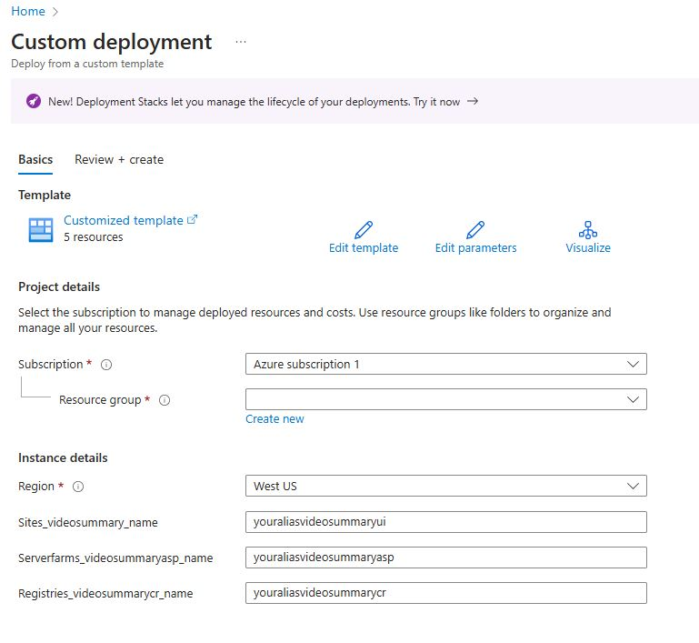
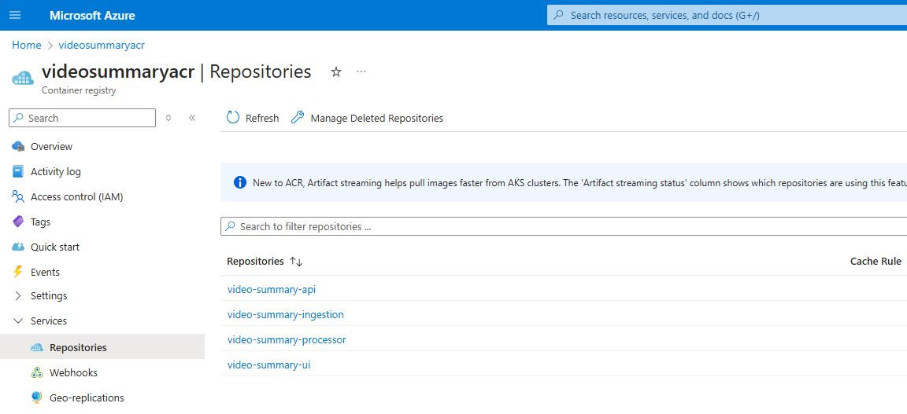

## Creating Azure Container Registry

To save time, we have an ARM template to get the resources created:

- Container Registry (Used to store Docker Images for Application and Services)

Go ahead and Deploy to Azure

[](https://portal.azure.com/#create/Microsoft.Template/uri/https%3A%2F%2Fraw.githubusercontent.com%2Ffelipecembranelli%2Fyoutubeblink%2Frefs%2Fheads%2FNEW_ARCHITECTURE%2F03-A-Push-the-docker-images-to-acr%2Fazuredeploy-acr.json)

> 📝 Please Note, Create a new resource when prompted, such as: **rg-video-summary** and substitute your network alias for **youralias**, or something unique that will appear as a FQDN for accessing your Azure Pet Store Application.

You should see something similar to the below image:



> ⏱ The resource provisioning will take some time. **Do not wait!** Continue with the guides. Remember your Resource Group!

# Push the Docker Images to Azure Container Registry

Run the following commands:

```
az login

az account list --output table
```

> 📝 Alternatively, you can use the following commands to login on ACR:

```
TOKEN=$(az acr login --name videosummaryacr.azurecr.io --expose-token --output tsv --query accessToken)
```

```
docker login videosummaryacr.azurecr.io --username 00000000-0000-0000-0000-000000000000 --password-stdin <<< $TOKEN
```

Please Note, the following is what enables us to get Web Hook control for our App Service Continuous Integration:

```
az acr update -n <youraliasvideosummarycr> -g <yourresourcegroup> --admin-enabled true
```

> 📝 Reference: https://learn.microsoft.com/en-us/azure/container-registry/container-registry-authentication?tabs=azure-cli

Now, tag your local Docker images built in the previous guide so that we can push it to Azure Container Registry then push it:

```
docker image tag video-summary-api:latest videosummaryacr.azurecr.io/video-summary-api:latest

docker image tag video-summary-processor:latest videosummaryacr.azurecr.io/video-summary-processor:latest

docker image tag video-summary-ui:latest videosummaryacr.azurecr.io/video-summary-ui:latest

docker image tag video-summary-ingestion:latest videosummaryacr.azurecr.io/video-summary-ingestion:latest
```

Pushing the images:

```
docker push videosummaryacr.azurecr.io/video-summary-api:latest

docker push videosummaryacr.azurecr.io/video-summary-processor:latest

docker push videosummaryacr.azurecr.io/video-summary-ui:latest

docker push videosummaryacr.azurecr.io/video-summary-ingestion:latest
```

