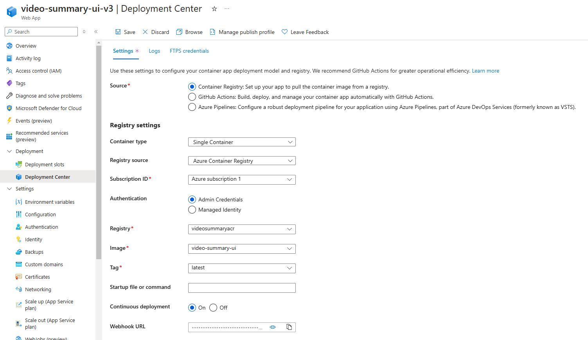
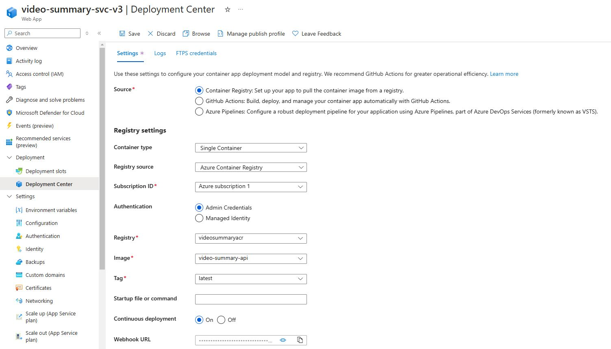

# Configure App Service for continuous deployment

In this section, we'll configure App Service for continuous deployments of Azure Container Registry Docker image updates.

Head to Azure Portal > App Services and find your App Service previously. Go to > Deployment Center and configure as shown below:

