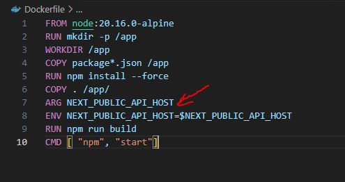
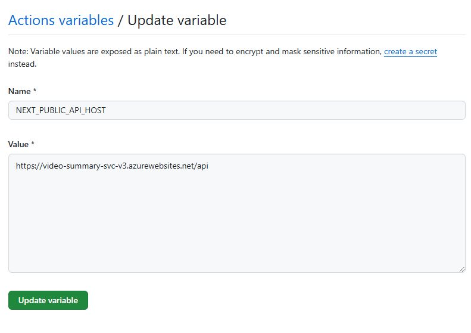

# Configure Git Hub Action for CI/CD into App Service

In this section, we'll configure Git Hub Action for the app CI/CD into App Service

Head to Azure Portal and find your Container Registry and copy your Login Server, Username and Password off somewhere (you will need them)

You should see something similar to the below image:


# API (.NET)
Head to GitHub repo > Settings > Secrets, , add a secret to store the Azure Container Registry Secret from above. Create a VIDEOSUMMARYACRSECRET, and paste in password from above.

You should see something similar to the below image:


Workflow sample:

```
# Docs for the Azure Web Apps Deploy action: https://github.com/Azure/webapps-deploy
# More GitHub Actions for Azure: https://github.com/Azure/actions

name: Build and deploy ASP.Net Core app to Azure Web App -- webApp-video-summary-api-dotnet

env:
  AZURE_CONTAINER_REGISTRY: videosummaryacr.azurecr.io
  AZURE_CONTAINER_REGISTRY_USERNAME: videosummaryacr
on:
  push:
    branches:
      - master
  workflow_dispatch:

jobs:
  deploy:
    runs-on: ubuntu-latest
    steps:
      - uses: actions/checkout@v4
      - name: Checking the file system listing
        run: |
          ls -al
      - uses: azure/docker-login@v1
        name: Build Docker image
        with:
          login-server: ${{ env.AZURE_CONTAINER_REGISTRY }}
          username: ${{ env.AZURE_CONTAINER_REGISTRY_USERNAME }}
          password: ${{ secrets.VIDEOSUMMARYACRSECRET }}
          
      - name: Push Docker image to Azure Container Registry
        run: |
          ls -al
          docker build . -t ${{env.AZURE_CONTAINER_REGISTRY}}/video-summary-api:latest -t ${{ env.AZURE_CONTAINER_REGISTRY }}/video-summary-api:${{ github.sha }}
          docker push ${{ env.AZURE_CONTAINER_REGISTRY }}/video-summary-api:${{ github.sha }}
          docker push  ${{ env.AZURE_CONTAINER_REGISTRY }}/video-summary-api:latest
```

# Frontend (UI - Nextjs)

Create the secrets and variables needed:


> ⏱ ATTENTION: The NEXT_PUBLIC_* variables are replaced at building time. This is why we need to inject it during the docker image creation, as shown below:

Dockerfile:



GitHub config:


Workflow sample:

```
name: Build and deploy Node.js app to Azure Web App - webapp-video-summary-dotnet-fe

env:
  AZURE_CONTAINER_REGISTRY: videosummaryacr.azurecr.io
  AZURE_CONTAINER_REGISTRY_USERNAME: videosummaryacr
on:
  push:
    branches:
      - master
  workflow_dispatch:

jobs:
 deploy:
    runs-on: ubuntu-latest
    steps:
      - uses: actions/checkout@v4
      - name: Checking the file system listing
        run: |
          ls -al
      - uses: azure/docker-login@v1
        name: Build Docker image
        with:
          login-server: ${{ env.AZURE_CONTAINER_REGISTRY }}
          username: ${{ env.AZURE_CONTAINER_REGISTRY_USERNAME }}
          password: ${{ secrets.VIDEOSUMMARYACRSECRET }}
          
      - name: Push Docker image to Azure Container Registry
        run: |
          ls -al
          docker build --build-arg NEXT_PUBLIC_API_HOST=${{ vars.NEXT_PUBLIC_API_HOST }} -t ${{env.AZURE_CONTAINER_REGISTRY}}/video-summary-ui:latest -t ${{ env.AZURE_CONTAINER_REGISTRY }}/video-summary-ui:${{ github.sha }} .
          docker push ${{ env.AZURE_CONTAINER_REGISTRY }}/video-summary-ui:${{ github.sha }}
          docker push ${{ env.AZURE_CONTAINER_REGISTRY }}/video-summary-ui:latest
```


