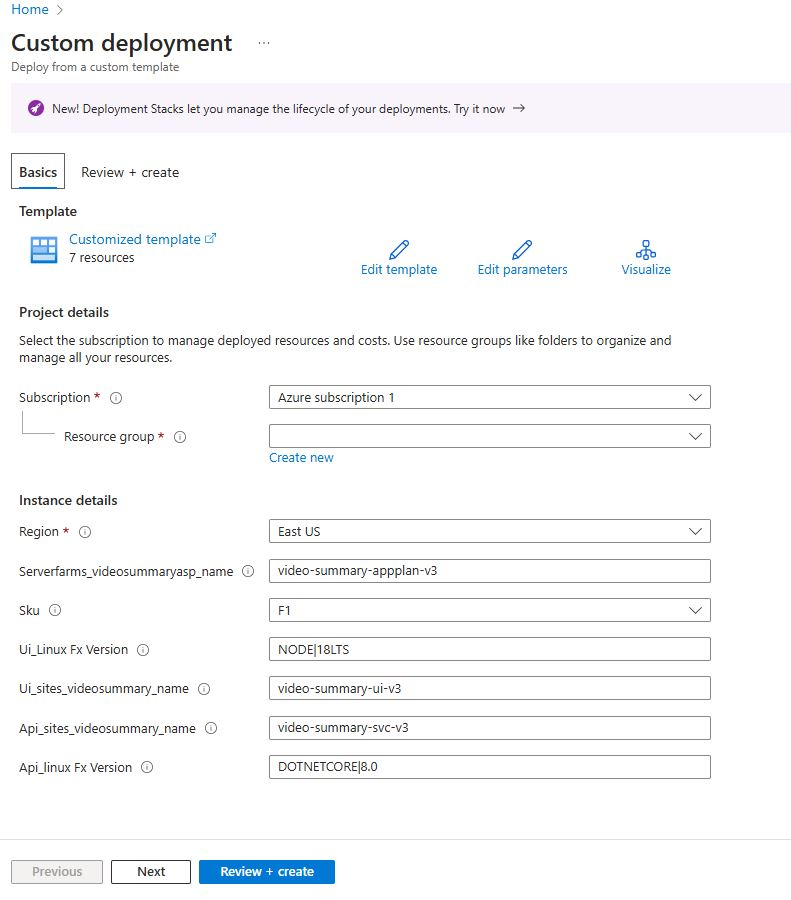

## Creating App Services

To save time, we have an ARM template to get a few Azure resources created:

- App Services (Used to store Docker Images for the UI Application and Backend API Service)
- App Service Plan (Resources needed to host the application and services)

Go ahead and Deploy to Azure

> 📝 Please Note, Create a new resource when prompted, such as: **rg-video-summary** and substitute your network alias for **youralias**, or something unique that will appear as a FQDN for accessing your Azure Pet Store Application.

You should see something similar to the below image:

> ⏱ The resource provisioning will take some time. **Do not wait!** Continue with the guides. Remember your Resource Group!
