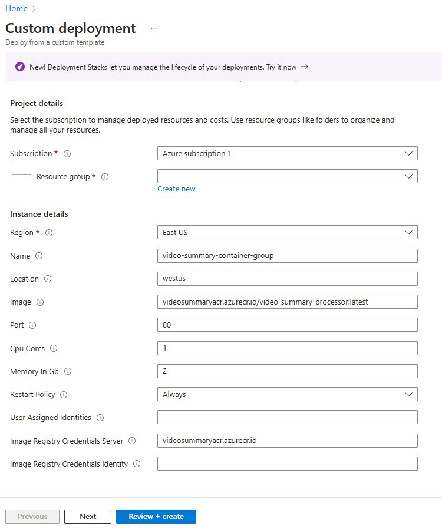

## Creating Container Instances

# Prerequisites

To pull container images stored in an Azure container registry when deploying to container groups with Azure Container Instances you will need to configure the registry access. One way to do this is to create a Microsoft Entra managed identity.

```
export myResourceGroup=[YOUR_RESOURCE_GROUP]

az identity create --resource-group $myResourceGroup --name myACRId

# Get resource ID of the user-assigned identity
USERID=$(az identity show --resource-group $myResourceGroup --name myACRId --query id --output tsv)

# Get service principal ID of the user-assigned identity
SPID=$(az identity show --resource-group $myResourceGroup --name myACRId --query principalId --output tsv)

echo $USERID

echo $SPID

```

# Deploy using an Azure Resource Manager (ARM) template

To save time, we have an ARM template to get the container instances for the Video Summary Processor component.

Go ahead and Deploy to Azure

[](https://portal.azure.com/#create/Microsoft.Template/uri/https%3A%2F%2Fraw.githubusercontent.com%2Ffelipecembranelli%2Fyoutubeblink%2Frefs%2Fheads%2FNEW_ARCHITECTURE%2F07-A-create-container-instances%2Fazuredeploy-aci-processor-v2.json)


You should see something similar to the below image:



> ⏱ The resource provisioning will take some time. **Do not wait!** Continue with the guides. Remember your Resource Group!
