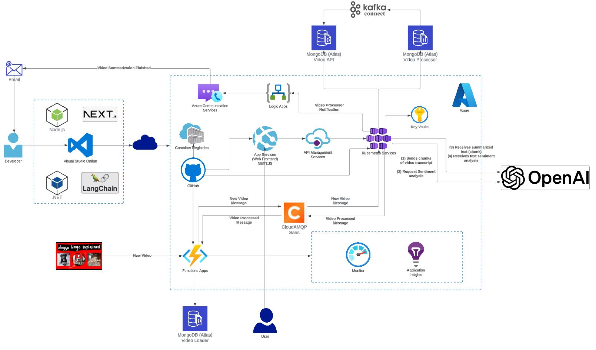

# YoutubeBlink
Create YouTube video summaries using Langchain, Javascript and OpenAI APIs.

Live App Demo: https://openai-video-summary-fe.vercel.app/

Medium article: https://medium.com/@felipecembranelli/youtubeblink-an-openai-video-summary-generator-37ab541c9493

## Do you want access to the source code?

Please send me a message: felipecembranelli@live.com

## Architecture Overview

As mentioned in the article, the objective is for you to be able to learn and showcase the application of LLM in a real life application within Azure. 

Below are some of the resources that are implemented in this solution:

- CI/CD into Azure App Service, Azure Functions & Azure Kubernetes Service (To be done) using GitHub Actions

- Message queue mechanism using CloudAmqp (RabbitMq): in the future implementation the ideia is to replace it by Azure Service Bus

- N-Tiered Architecture using Next.Js, Node.js and .NET Application deployed to App Services and Backend Services deployed to Azure Kubernetes Service (To be Done)

- N-Tiered Correlated Telemetry between the layers, allowing for Full End to End Reporting using KQL within Azure Application Insights (Partially - API)

- API Management in front of backend services, ensuring the frontend pplication is subscribed to and requests are made within rate/quota limits (To be Done)

- Blue/Green Deployments to YoutubeBlink Application via Deployment Slots (To be Done)

- Functional .NET and Node.j code showcasing the Azure SDK's for integrating with these services (To be Done)

- Azure Serverless: Logic Apps (To be Done) and Function Apps

